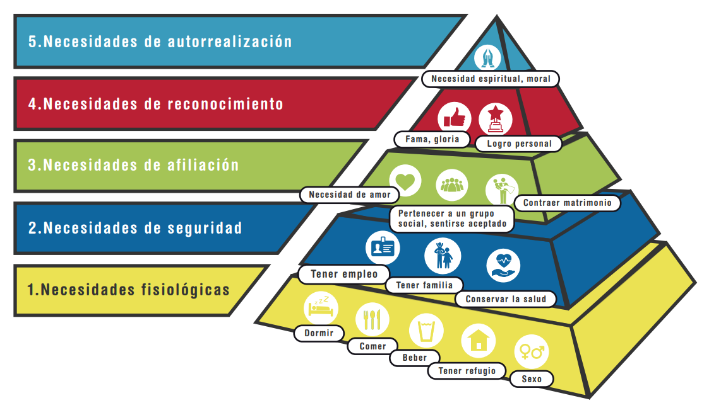
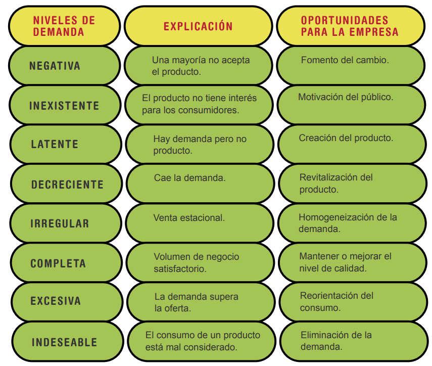
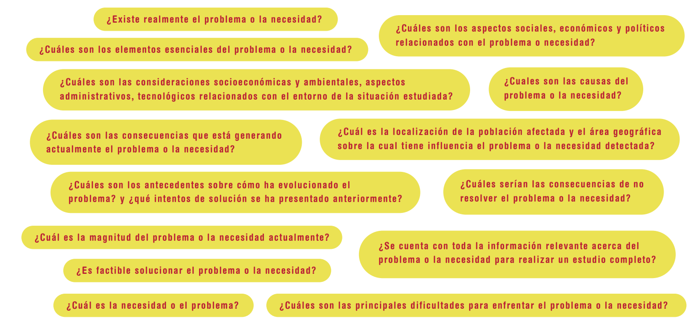
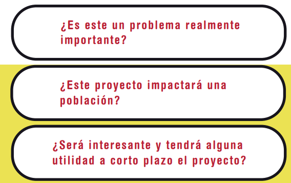
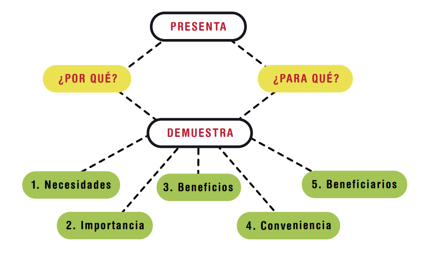
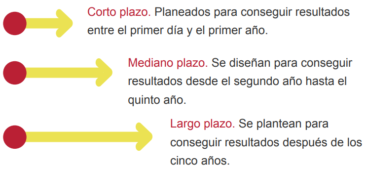

# Formulacion de peoyectos en mi profesion

## Introduccion a la Formulacion de peoyectos en mi profesion

El tener un conocimiento algunas veces no es suficiente para lograr el éxito esperado, Solo hay una oportunidad para la
primera impresión y esa primera impresión se fundamenta en como se elabora y se enfoca un proyecto.

Es imprescindible que un emprendedor conozca sus fortalezas y debilidades para complementarlas con sus conocimientos, esto
junto a la destreza de cómo tomar las decisiones correctas a la hora de identificar las prioridades de un proyecto, logrando
así la mayor eficacia.

Antes de iniciar un proyecto, un emprendedor debe tener en cuenta sus habilidades innatas y los conocimientos adquiridos
en su proceso de formación y en la experiencia laboral, esto para lograr enfocarse en la solución de un problema o una
necesidad desde las fortalezas identificadas; puesto que este diagnóstico permite comodidad y seguridad al momento de
proponer ideas potencialmente innovadoras que contribuyan a mejorar la calidad de vida de los usuarios y especialmente del
mismo emprendedor.

En el presente material, se abordarán conceptos fundamentales para el inicio de un proyecto; como la importancia de conocerse,
el pensamiento creativo, la identificación del problema a resolver y el planteamiento del proyecto.

## Factores clave Para iniciar un proyecto

basado en la profesión que se desempeña, es necesario analizar ciertas variables las cuales pueden ofrecer claridad y
optimizar las probabilidades de llevarlo a cabo con éxito; entre ellas están:

### Conocimiento de sí mismo

“Sin conocernos a nosotros mismos no podemos ir más allá de las ilusiones auto proyectadas de la mente”. Krishnamurti (2012).

No es suficiente demostrar interés y entusiasmo para plantear e iniciar un proyecto más es necesario identificar las
fortalezas y debilidades personales de cada integrante del equipo de trabajo o del ejecutor del proyecto, para así identificar
la capacidad de afrontar determinados retos y encausar los recursos y cualidades de manera que puedan ser aprovechados
eficientemente.

*Aspiración, deseo y propósito:*

    La aspiración como apetencia intensa de alcanzar un objetivo valorado como importante

    el deseo como el interés y vehículo para desarrollar una actividad

    el propósito como la voluntad de llevar a feliz término el proyecto, son tres aspectos que permitirán construir un
    camino certero frente al destino del proyecto, sus fases y actividades.

El gestor de proyecto debe enfocar sus aspiraciones hacia conseguir una meta definida en función de valores y principios que
aseguren una correcta interacción con el entorno que rompan con las cadenas del pesimismo. Muchos proyectos de emprendimiento
no se materializan porque el visionario pierde la motivación y el foco de sus propósitos. Es importante proyectarse siempre
como un triunfador, trabajando con deseo en pro del cumplimiento de las aspiraciones y procurando que los propósitos se encuentren
alineados con el perfil y conocimientos. Se deben considerar las siguientes reflexiones:

“Elige un trabajo que te guste y no tendrás que trabajar ni un día en tu vida” --> Confucio

“Toda profesión conlleva la responsabilidad de comprender las circunstancias que habilitan su existencia” --> Robert Gutman

“Creatividad es un acto de fe; para crear primero hay que creer” --> Miguel Ángel Cornejo

### Pensamiento creativo y resolución de problemas

El pensamiento creativo es la capacidad que tiene una persona de adaptar lo que conoce a situaciones nuevas que requieren de sus
habilidades para satisfacer una necesidad; suele expresarse en propuestas, conclusiones o en decisiones; sin embargo, también se
puede representar materialmente a través de un objeto o un documento que es potencialmente útil en una determinada situación.

El conocimiento adquirido por medio de la formación y las prácticas de la profesión, fortalecen las habilidades de los individuos y
sirven como referencia para desarrollar ideas que puedan concretarse a través de propuestas con potencial de innovación, factor que
determina el futuro de un proyecto.

## Conceptos básicos

Al iniciar un proyecto, es importante tener claros los conceptos que intervienen en su planteamiento; entre ellos se encuentran:

### Necesidad

Para Bello (1973),“la necesidad es el deseo de disponer de un medio idóneo para prevenir o eliminar sensaciones penosas, o
para provocar, conservar o incrementar sensaciones agradables”.

La pirámide de Maslow es una teoría psicológica la cual clasifica las diferentes necesidades percibidas por los seres humanos:
Las actividades económicas están movidas por la búsqueda constante de satisfacción de necesidades y por ello la identificación
de propuestas creativas e innovadoras para dar solución a necesidades de una población; se convierte en el objetivo principal
del proyecto.

### Proyecto

Según Vértice (2008), un proyecto es una operación necesaria para realizar un trabajo de gran importancia el cual no se
ejecuta de manera repetitiva, y que se planifica y desarrolla de acuerdo a las especificaciones técnicas establecidas por
unos objetivos, costos, inversiones y plazos;

sus principales características son:

    ● Trascendencia. El objetivo es lograr resultados que trasciendan para los intereses de quienes lo inician.
    
    ● Dinamismo. Está en continua evolución, lo que requiere que se trabaje con gran agilidad para llevarlo a cabo.
    
    ● Irreversibilidad. En algún momento del proyecto se necesitará tomar decisiones irreversibles; generalmente esto
    no ocurre en actividades continuas.

Los proyectos tienen elementos específicos los cuales definen el camino a seguir; estos son:

    ● Planeación estratégica. Está avalada por la visión y la  misión. A través de la planeación estratégica se refleja
    el propósito y el impacto del proyecto, por medio de la organización de las actividades, fases y diferentes eventos
    que harán parte del mismo, además, pone en evidencia las necesidades, limitaciones, posibles riesgos y responsabilidades
    del equipo de trabajo.

    ● Desarrollo de producto o servicio. Una vez detectado el problema o la necesidad, se realizan sondeos con la población
    objetivo, después se inicia el diseño, el prototipado y la producción del producto a comercializar o del servicio a
    prestar.

    ● Comunicación. Es la que permite el correcto flujo de información, la toma de decisiones y asegurar las buenas relaciones
    entre los integrantes del proyecto y los distintos grupos de interés como los proveedores y clientes.

    ● Recursos de diferentes tipos: financieros, tiempo, equipos y herramientas, instalaciones y el humano. Los recursos
    son los que determinan la viabilidad del proyecto.

También se puede afirmar que un proyecto es una agrupación de elementos los cuales permiten desarrollar actividades de
manera ordenada, con la finalidad de satisfacer las necesidades de una determinada población.

Antes de iniciar un proyecto deben realizarse ciertas preguntas, las cuales se describen a continuación:

    ¿Qué? Nombre del proyecto ¿Qué vamos a hacer?

    ¿Por qué? Fundamentación, Se deberá realizar un diagnóstico de la situación, su factibilidad y por qué se solucionaría
    el problema de esta forma.

    ¿Para qué? Objetivos, Determinar los objetivos y cantidades de recursos necesarios para alcanzar los objetivos.

    ¿Dónde? Localización geográfica, Ciudad, localidad, barrio.

    ¿Cómo? Listado de actividades, Será la manera de concretar el proyecto.

    ¿Quiénes? Responsables ¿Quiénes realizarán las actividades?

    ¿Cuándo? Plazos, Inicios, pasos intermedios, finalización.

    ¿Cuánto? Presupuesto, (incide en la viabilidad del proyecto) Listado de recursos y sus costos.

    ¿Será posible? Análisis DOFA y factores de riesgo (incide en la viabilidad del proyecto) Debilidades, oportunidades,
    fortalezas y amenazas.

### Estado del arte

Según Pardo (2006), es un método empleado en la comunidad científica para hacer referencia a la búsqueda y recolección
de la información relacionada con la situación que se está investigando, y de esta manera plantear varios puntos de
vista, y permitiendo realizar comparaciones con otros postulados o conocimientos y brindando más oportunidades de entender
el problema analizado. El estado del arte se puede resumir en tres pasos:

Contextualización, Clasificación, Categorización.

En el levantamiento de un estado del arte se revisan portales científicos, bases de datos (ver biblioteca SENA) documentos
de grupos de investigación, ferias o eventos académicos y libros actuales, se recomienda consultar recursos de máximo
tres años de antigüedad; toda estas fuentes de información permiten determinar el orden de la investigación, identificar
los actores vigentes y conocer y referenciar el análisis previo que han realizado otros investigadores; lo anterior permite
sustentar el proyecto sobre bases teóricas confiables.

### Demanda

Según Spencer (1993), el término demanda se refiere a unidades de producto o servicio que los consumidores o clientes están
dispuestos a comprar durante un periodo especificado de tiempo y bajo un conjunto de condiciones. También afirma que es
la actitud o reacción sobre un bien por parte del comprador.

La cantidad de personas que compran una mercancía en un momento dado depende de su precio; cuanto más elevado sea éste,
menor será la cantidad de personas que estarán dispuestas a adquirirlo y cuanto más baje su precio en el mercado, más
unidades serán demandadas. Es necesario que los demandantes (clientes) sientan el deseo y tengan la capacidad para pagar
por el producto.

Al momento de iniciar un proyecto, es conveniente tener un marco de referencia sobre la demanda, para esto es recomendable
realizar estudios sobre los posibles competidores y el mercado objetivo.

- Factores que inciden en la variabilidad de la demanda

        ● La renta. Influye en la cantidad de un producto que pueden comprar los consumidores a un precio determinado.

        ● Los gustos. No todas las personas gustan de lo mismo y generalmente los gustos no son permanentes.

        ● Precio de los sustitutos y complementarios. El pan y la mantequilla son productos complementarios uno del otro
          y algunas personas no conciben su consumo por separado; si se presenta un incremento en el precio del pan, es
          probable que no solo se resienta su demanda, seguramente también lo sentirán los productores de la mantequilla.

          En el caso de los productos sustitutos, como el café y el té, la subida de precio de alguno de ellos incrementará
          la demanda del otro.

        ● Las expectativas. Lo que esperan los consumidores sobre los niveles de renta futura, afectan las decisiones de
          compra.

          Una persona que espera ganar mucho dinero en un futuro cercano es probable que gaste mucho más que una persona
          la cual espera recibir un salario considerablemente menor. De igual manera, hay ocasiones en las cuales se aceleran
          las compras antes que los precios se incrementen.

        ● La población. Cuanto mayor el tamaño de un mercado, mayor es la cantidad que se compra de una mercancía o un
          bien. En un determinado territorio con creciente población, la demanda de vehículos irá en aumento año tras año,
          mientras que en una región donde su población decrece, la demanda de vehículos también lo hará.

Se muestra a continuación, los diferentes niveles de demanda, el motivo y las oportunidades para un gestor de proyectos:

## Descripción del problema

El primer paso cuando se inicia un proyecto es reconocer el problema o establecer la necesidad que se quiere satisfacer.

Para Miranda (2010), es de suma importancia tener conocimiento de las características específicas de dicho proyecto, además
de las causas y otros factores que pueden ser fundamentales a la hora de buscar soluciones a los inconvenientes que se puedan
presentar a lo largo del mismo.

En la descripción del problema es de gran utilidad tener en cuenta los siguientes interrogantes:

## planteamiento

Al momento de redactar el problema, se debe registrar lo que está sucediendo y las consecuencias que está causando; además,
se debe concluir con un interrogante que sea congruente con el objetivo general. En su planteamiento se debe tener en cuenta
las siguientes preguntas:

El planteamiento del problema supone una justificación y objetivos estructurados y articulados entre sí para llevar a buen
término el proyecto.

### Justificación del proyecto

Explica las razones por las que se pretende llevar a cabo el proyecto e incluye:

        ● El alcance del proyecto a corto, mediano y largo plazo.
        ● Múltiples alternativas para solucionar el problema o lograr un objetivo identificado.
        ● Las respuestas que buscan los interesados para participar en el proyecto.
        ● Las razones y argumentos que invitan a invertir en la ejecución del proyecto.

En el siguiente esquema se muestra graficamente las razones por las cuales se desea llevar a cobo el proyecto, basado en
dos preguntas logicas, por que? y para que?

### Objetivos

Son los resultados que se desean obtener con el desarrollo del proyecto; están enfocados en resolver el problema previamente
identificado. La redacción de un objetivo inicia con un verbo en infinitivo, por ejemplo: lograr, reconocer, conseguir. Además,
deben ser realistas, limitados en el tiempo, realizables y precisos.

Los objetivos dependiendo del tiempo propuesto, se clasifican en:

Según su naturaleza se clasifican en:

    Objetivo general: Da solución al problema o expresar el principal propósito del proyecto; no está enfocado en
    resultados concretos ni está diseñado para ser medido a través de indicadores.

    Objetivos específicos: Describen la manera de conseguir el objetivo general, indicando la ruta que se debe seguir para
    lograrlo.

## Ejemplo del planteamiento de un problema detectado en restaurantes de países asiáticos

### planteamiento del problema

El continuo cambio cultural y económico que está presentado los países asiáticos, está generado continuas demandas en ámbitos
gastronómicos para satisfacer a nuevos clientes con mayores exigencias no solo en la búsqueda de nuevos sabores, también el aspecto
visual juega un papel determinante en los platos exóticos que impulsan países como Japón. En algunos restaurantes se han
implementado propuestas para satisfacer esta falencia, sin embargo, en muchos casos no han causado mayor impacto. La competencia
ha intensificado la necesidad de encontrar soluciones creativas que ofrezcan una ventaja competitiva al establecimiento.
Es sabido el gusto de los orientales por los productos innovadores y también por los productos latinos, lo cual genera una gran
oportunidad de negocio y por lo tanto surge la siguiente pregunta:

    ¿Cuáles son los productos que pueden satisfacer a los posibles clientes asiáticos?

De no desarrollarse este proyecto, es probable que queden insatisfechas algunas necesidades de clientes potenciales que demandan
productos latinos; también se estaría perdiendo una excelente oportunidad de negocio

### Justificación

Colombia cuenta con productos que históricamente han tenido gran aceptación en el mercado del lejano oriente, por lo tanto,
se abre la posibilidad de ofrecer variadas opciones que puedan impactar en los platos exóticos que cada vez son más demandados
en estos territorios; además el gusto por lo diferente que esta cultura evidencia, podría generar una gran oportunidad de
negocio.

### Objetivo general

Identificar los productos que puedan representar oportunidades de exportación hacia países del lejano oriente, y analizar
la viabilidad para ser comercializados en los territorios donde se ha detectado la necesidad.

### Objetivos específicos

● Reconocer cuáles son las diferentes exigencias del mercado asiático y sus diferentes expectativas (relacionadas con la
necesidad detectada).

● Determinar la manera cómo influyen los costos de los procesos logísticos en las futuras exportaciones de los productos
que pretende comercializar la compañía.

● Establecer las estrategias para comercializar el producto que puede satisfacer la demanda del mercado asiático.

Esta necesidad fue satisfecha por emprendedores colombianos a través de la exportación de papa criolla pequeña y uniforme,
la cual paradójicamente no es consumida por lo clientes; se fríe y se acomoda en los platos para darle una mejor presentación.

## infografia identificacion y formulacion de un proyecto

