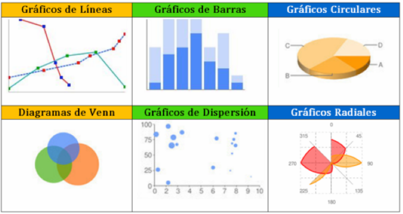

# Establecer las actividades, requerimientos y fases que permitan lograr el propósito del proyecto

## Introduccion

El análisis de los requerimientos de la población objetivo constituye uno de los pilares necesarios para evidenciar la
viabilidad del proyecto; es importante clasificarlos y programar su influencia en cada una de las fases del proyecto.

la planeación de las actividades, fundamentos de estadística y procesos de argumentación, interpretación y proposición,
elementos fundamentales para la ejecución ordenada y coherente del proyecto.

## Fases

Sin importar el tamaño o alcance del proyecto a iniciar, para desarrollar una eficiente gestión, se deben clasificar las
actividades del proyecto en etapas y administrar de forma correcta los recursos para cada una, esto con el fin de aumentar
las probabilidades de éxito del proyecto.

[Fases de un proyecto](image-7.png)

Según Palacios (2013), un proyecto no está sujeto a un número exacto de fases. Se debe tener en cuenta que una fase, es
una agrupación de actividades las cuales finalizan con uno o más entregables, es decir, con el objetivo que se ha trazado
para cada una de ellas. Las fases generalmente se completan de forma secuencial, lo que permite una planificación más
congruente del proyecto, además, facilita la gestión y el control.

La cantidad de fases se encuentra determinada por el tamaño, complejidad y el impacto esperado. Las fases de un proyecto
tienen las siguientes características:

    ● El trabajo desarrollado en cada una tiene un enfoque diferente, lo que determina la intervención de recursos y
    habilidades diferentes.

    ● Se aplican controles de las actividades desarrolladas en cada una de las fases.

    ● Cuando finaliza una fase, se transfiere el trabajo realizado a la fase siguiente; este proceso es conocido como
    puerta de etapa o revisión de fase.

### Iniciación

Es la fase donde se identifica la necesidad de una determinada población, se plantea el problema y los objetivos y la
justificación. Estos procedimientos son fundamentales, debido a que, si los objetivos se planean de una manera equivocada,
existen muchas probabilidades de que el proyecto tenga dificultades.

### Planeación

Es esta fase se planifican las diferentes actividades necesarias para desarrollar el proyecto, se especifican los requerimientos
necesarios para llevar a cabo dichas actividades, y se realiza una estimación de los riesgos y los recursos disponibles.

#### Planeación de las actividades

Una vez identificados el problema, los objetivos, la justificación y se ha dado respuesta a los interrogantes formulados
en la fase de iniciación del proyecto, es necesario realizar un plan de actividades en el cual se registren las tareas que
se requieren para llevar a cabo en cada una de las fases del proyecto. Los aspectos que se deben considerar para desarrollar
un plan de actividades son:

    Elaborar una lista completa y detallada de todas las actividades a realizar.

    Dividir las actividades en "mini proyectos" para poder tener mayor control.

    Tener en cuenta el objetivo general del proyecto.

    Determinar el tiempo disponible para realizar determinados procesos.

    Establecer cuál es el presupuesto y los recursos necesarios para desarrollar las actividades.

    Establecer un objetivo e indicadores para medir las actividades en el final de cada bloque; este ejercicio es fundamental
    para revisar si se han conseguido los objetivos planeados.

    Asignar el número de personas requeridas para llevar a cabo cada actividad.

    Tener claro cómo y dónde se van a realizar las actividades.

    Analizar los posibles riesgos que puedan afectar las actividades del proyecto.

En la siguiente gráfica se puede observar un ejemplo sencillo de un plan de actividades de un proyecto basado en la instalación
de cocinas integrales.

### Ejecución

Es la fase donde se pone en marcha el proyecto materializando las actividades planteadas en la etapa de planificación. Se
debe tener en cuenta el flujo de la información, ya que es vital para que se tomen decisiones rápidamente cuando se presenten
problemas que deban solucionarse de manera inmediata.

### Evaluación, control y cierre

La finalidad de las acciones desarrolladas en esta etapa es comprobar que los objetivos sean logrados en el tiempo y
calidad planteados previamente, para lo cual es necesario implementar indicadores que midan del rendimiento de los procesos,
con la finalidad de que se puedan corregir los errores a través de la comparación entre la planificación diseñada y los
valores obtenidos.

En esta fase se elabora un informe donde se describe como se ha desarrollado el proyecto, los inconvenientes que se
encontraron a lo la largo de este, la metodología implementada, la experiencia que se obtuvo y las conclusiones que pueden
extraer con la evaluación y su control.

## Requerimientos

Para Rodríguez (2005):

    “los requerimientos son las especificaciones técnicas y de uso que debe cumplir el proyecto, por lo tanto, varían uno
    del otro”.

Por medio de la postulación de los requerimientos de un proyecto se garantiza el cumplimiento de las expectativas de las
personas que están involucradas directa o indirectamente con él. Para el planteamiento de los requerimientos es necesario
hacerse ciertas preguntas, como:

    ¿Qué requiere el proyecto para llevarlo a cabo?
    ¿Existe claridad sobre el producto o servicio que se producirá a través del proyecto?

Los requerimientos del proyecto son el medio por el cual se documentan las necesidades que provienen de la población objetivo,
relacionadas con el comportamiento, limitaciones y la calidad esperada de los productos o servicios que ofrecen las empresas
del sector y estos se pueden reflejar en una nueva característica de un producto o servicio.

### Clasificación de los requerimientos

En un proyecto, es necesario aplicar estrategias para identificar los requerimientos que realmente sean necesarios; para
un estudio más detallado, dichos requerimientos se clasifican en:

- Requerimiento de negocio

        Definen las metas o necesidades que se debe tener en cuenta al iniciar un proyecto; argumentan las razones por
        las cuales se decidió llevarlo a cabo, y describen los objetivos que se deben alcanzar y los indicadores para
        medir su éxito.

- Requerimientos de stakeholders

        Se debe tener en cuenta que los stakeholders son todas aquellas personas u organizaciones que están relacionadas
        con una determinada empresa y que se pueden ver afectadas por las actividades y las decisiones que la compañía
        tome en un momento dado; los stakeholders son los accionistas, empleados, clientes, proveedores, entre otros.

        Por lo tanto, estos requerimientos describen las necesidades de estos grupos, las cuales sirven como enlace entre
        los requerimientos de negocio y los diferentes requerimientos de solución.

- Requerimientos de solución

        Hacen referencia a las soluciones que satisfacen los requerimientos de negocio y de los stakeholders.

- Requerimiento funcional

        Define lo que se supone debe hacer un determinado producto o servicio para satisfacer las necesidades demandadas
        por los clientes; es decir, se detallan los servicios o sus funciones, por ejemplo, se ha detectado que existe la
        necesidad de un GPS que reporte las zonas donde existe mayores posibilidades de que se presenten accidentes al
        momento de viajar por carretera; este es un requerimiento funcional.

- Requerimiento no funcional

        Define como debe ser el producto o servicio; describe atributos relacionados con:
        
            la calidad, rendimiento, disponibilidad, mantenimiento, fiabilidad o seguridad;
        
        un ejemplo del requerimiento no funcional puede ser que el lenguaje de programación del GPS esté basado en JAVA,
        y por lo tanto proporciona gran velocidad en el procesamiento de datos, o una interfaz rápida que le permita al
        usuario tener una mejor experiencia al momento de utilizar el dispositivo.

- Requerimiento de transición

        Describe las características de una solución con la finalidad de realizar una transición sencilla del estado en
        el cual se encuentra el proyecto, hasta llegar a la situación futura deseada.

## Fundamentos de estadística

Según Martínez (2016), la estadística hace referencia al conglomerado de reglamentaciones y principios los cuales son
requeridos para observar, describir, cuantificar y analizar el comportamiento de una agrupación que contiene determinados
elementos. La estadística representa un soporte fundamental a la hora de tomar decisiones importantes.

### Conceptos

A continuación, se resaltan elementos básicos relacionados con el ejercicio de la estadística:

*Población:* Es la agrupación de objetos y/o personas que se desea investigar. Los elementos de la población son los que
la integran, pueden ser objetos y/o personas. Dependiendo del número de elementos que la conformen, se presentan dos clases
de poblaciones:

    ● Población finita. Es la población que está limitada; por ejemplo, el número de jugadores de un equipo fútbol, o la
    cantidad de medicamentos que hay en una farmacia.

    ● Población infinita. Esta población no cuenta con un límite, por ejemplo, el número de granos de arena existentes en
    una playa, o la cantidad de estrellas que hay en el universo.

*Parámetro:* Es una medida la cual sirve como referencia para describir una población. Por ejemplo:

    ● El total de emprendedores que formaron empresa a nivel nacional.
    
    ● Índice de desempleo en el último mes en la región caribe colombiana.

*Muestra:* Es el subconjunto de la población escogida; por ejemplo, 20 empleados de una compañía conforman una muestra del
total de trabajadores de la empresa estudiada

*Censo:* Cuando la muestra está conformada por toda la población se denomina censo.

*Muestreo:* Es el procedimiento mediante el cual se obtiene información valiosa basada en la muestra extraída.

*Variable:* Son las características de la población de interés; por ejemplo, en un proyecto de fabricación y comercialización
de accesorios para patinadores, se investiga a la población de personas que practican patinaje teniendo en cuenta sus ingresos,
agrupaciones, preferencias etc. Las variables pueden ser:

    a. Cualitativas. Miden atributos o cualidades las cuales no se pueden cuantificar; por ejemplo, la opinión, estado
    civil, el color de un producto.

    b. Cuantitativas. Miden características cuantificables; estas pueden ser edad, resistencia, ingresos, peso, altura.

*Clase:* Es una categoría por medio de la cual es posible agrupar los datos.

*Valor promedio:* Tiene como finalidad representar los valores de una agrupación de valores; por ejemplo, estatura promedia
o estado civil promedio de una determinada población.

### Inferencia y gráficos estadísticos

La inferencia estadística es la agrupación de métodos y técnicas de las cuales se extraen conclusiones importantes para
el proyecto, basadas en la información recopilada del análisis de una muestra. Pueden ser:

    ● Estimación. Procedimiento a través del cual se otorga un valor a un parámetro en un evento futuro, basados
    en las deducciones que se realizan a partir de estudios estadísticos.

    ● Prueba de hipótesis. Se utiliza para determinar si hay suficientes evidencias en una muestra de datos, para
    deducir que una determinada característica es válida para toda la población.

Para agrupar, clasificar y socializar datos estadísticos se usan herramientas gráficas como los gráficos estadísticos;
pueden ser:

#### A continuación, un ejemplo y su gráfica correspondiente

Una compañía productora de camisas está recibiendo una gran cantidad de reportes donde se registran varias quejas de sus
clientes debido a imperfectos en diferentes partes del producto. La compañía requiere identificar las fallas para tomar
las decisiones apropiadas y de esta manera corregir la situación.

Conclusión: Es notorio que la mayoría de los defectos se presentan en las puntadas torcidas, por lo tanto, se deben tomar
medidas para que los procesos sean corregidos; es evidente que se hará mayor énfasis en el porcentaje más elevado de
desperfectos, sin embargo, también es prudente considerar mejorar los demás procesos con porcentajes menores.

## Procesos de argumentación, interpretación, y proposición

Para materializar un proyecto, la capacidad argumentativa representa un atributo muy importante no solo para el área
comercial, sino para garantizar la comunicación y buen contacto con los futuros empleados, proveedores y posibles inversionistas.

La argumentación es la capacidad de defender una idea, postura u opinión, incluyendo múltiples razones que justifiquen dicha
postura, con honestidad y razones reales; para Díaz (2002), la argumentación está presente en las diferentes facetas del ser
humano; se utiliza constantemente para justificar formas de pensar y comportamientos, los cuales pueden ser utilizados para
influir en la forma de pensar de otros individuos.

### Objetivos del argumento

La influencia que pueda tener una persona sobre los demás, está estrechamente relacionada con la capacidad argumentativa
que posee, lo cual constituye un reflejo de la organización del pensamiento. A continuación, se destacan los objetivos del
argumento:

Influir en el receptor:

    Es la principal razón por la cual se hace un gran esfuerzo argumentativo; si se influye lo suficiente en el interlocutor,
    habrá mayores posibilidades de obtener el control de las situaciones.

Cambiar “algo” en el otro.

    Si hay diferencias con relación a la postura del receptor, se debe tratar de que acepte parte del postulado que se
    propone.

Relativizar “algo” en el otro.

    Se debe intentar eliminar los elementos del desacuerdo.

Asegurar “algo” en el otro

    Es muy importante reforzar o acentuar los puntos en los cuales hay un pleno entendimiento; este hecho puede facilitar
    la influencia en la toma de decisiones.

### Elementos de la argumentación

Estos elementos estructuran la base para que una persona influya en otros individuos; entre ellos se encuentran:

*El objeto:* Es el tema que conforma la base para iniciar una argumentación. Por ejemplo, el desempleo en el país.

*La tesis:* Es la postura que el argumentador toma y defiende. Por ejemplo, el estado debería apoyar más a los emprendedores.

*Los argumentos:* Son las razones en las cuales esta soporta la postura base de la argumentación. Por ejemplo:

    Si el estado apoya más a los emprendedores, se reducirán los índices de desempleo.
    Si el estado apoya más a los emprendedores, habrá mayor cantidad de técnicos, tecnólogos y/o profesionales aplicando
    los conocimientos que recibieron durante sus respectivas formaciones.
    Si el estado apoya a los emprendedores, se fortalecerá la industria en el país.

En cualquier proceso argumentativo existen tres procesos básicos importantes para el desarrollo de una buena comunicación,
estos son:

*Interpretar:* Se refiere a los actos que una persona lleva a cabo con la finalidad de comprender lo que ha sido planteado
en una situación particular. La interpretación de la información depende de la dificultad con la cual haya sido planteada
y el nivel intelectual del receptor; al interpretar, un individuo puede proyectar su forma de actuar y su personalidad.

*Argumentar:* Busca explicar las posturas planteadas en una situación. La persona que argumenta debe haber tenido interacción
con la situación argumentada, es aquí donde cobra sentido esta valiosa cualidad.

*Proponer:* En este elemento están incluidos continuamente la interpretación y la argumentación, ya que la interacción
con el interlocutor necesitará de propuestas, las cuales tendrán que ser interpretadas y argumentadas para evitar un
escenario de confrontación y refutación.
