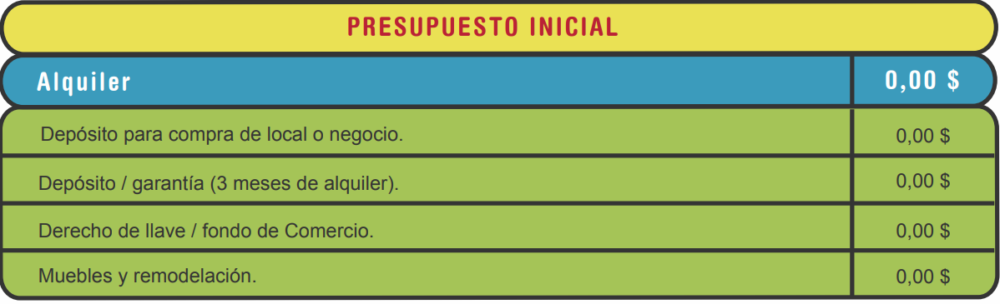
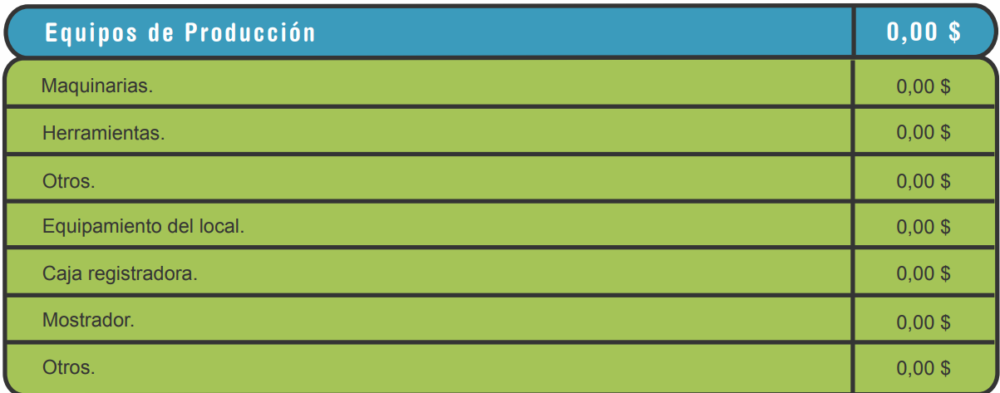
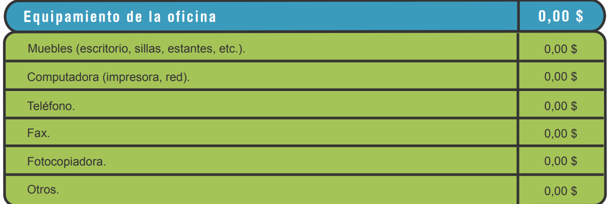
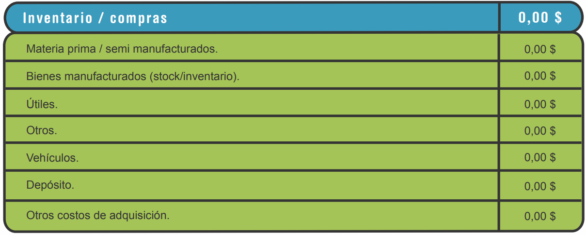
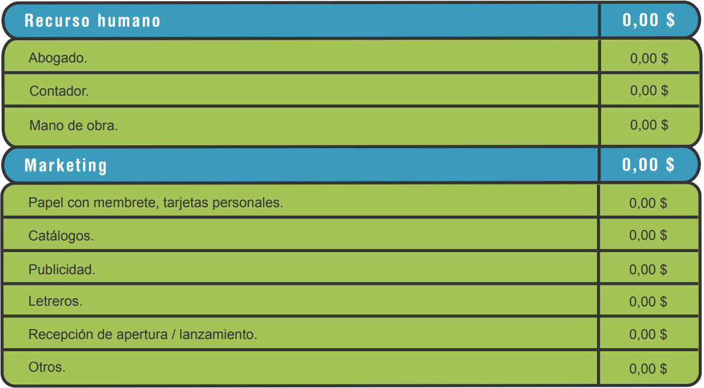
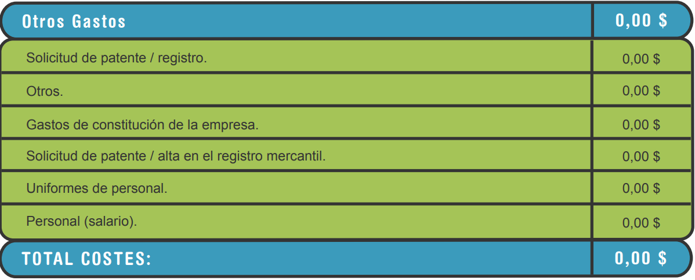
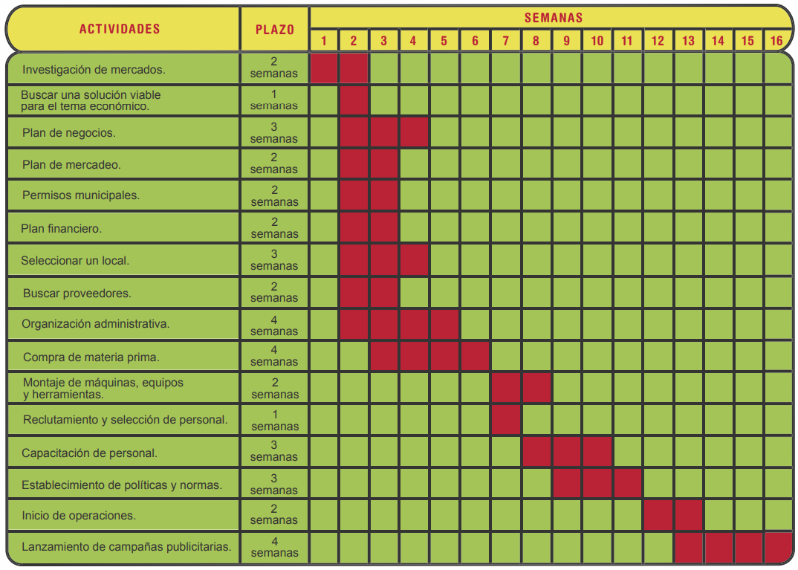

# plan de negocios, presupuestos, cronogramas y software aplicado

## Introducción al plan de negocios, presupuestos, cronogramas y software aplicado

Al momento de buscar financiación, se debe situar el sector económico donde se inscribe el proyecto y así identificar las
entidades idóneas para solicitar la financiación. Después, se construyen algunos elementos como un plan de negocios que
refleje de manera sencilla y convincente la propuesta, un presupuesto que proyecte cómo se invertirán los recursos financieros
y un cronograma que especifique las actividades para materializar el proyecto.

## Financiación

Las entidades financieras desempeñan un papel importante en la puesta en marcha del proyecto; gracias a ellas se puede
acceder al dinero por medio de préstamos o convocatorias; existen elementos que permiten exponer el proyecto de una
manera convincente y clara para solicitar recursos económicos a las entidades financieras, entre ellos:

## Plan de negocios

Para Hingston (2002), “uno de los primeros pasos para emprender cualquier empresa es la elaboración de un plan de negocios;
es un documento de planificación detallada que establece en palabras y en cifras lo que constituye su negocio. (tanto si
lo inicia, como si lo expande o diversifica)”.

En otras palabras, el plan de negocios es el documento donde se consolidan la oportunidad, la solución planteada, la manera
de monetizar o llevar a cabo los objetivos y los costos de la ejecución del proyecto. Al revisar un plan de negocios, los
aspectos que tiene en cuenta un inversionista son:

Investigación de mercado.
Control financiero.
Planificación apropiada.
Competencia y compromiso de las personas que integran el proyecto.

Otro factor que se debe destacar es la preparación y trayectoria que posean los integrantes del proyecto, ya que el compromiso
y la capacidad que reflejen incidirá en la decisión final de los inversionistas.

Es importante considerar los elementos básicos al momento de redactar un plan de negocios, entre los cuales se encuentran:

- MODELO DE NEGOCIO: Describe sobre los productos o servicios que se ofrecen, las características de negociación: tiempos
de pago, cantidades y canales de distribución.

- DEFINICIÓN DEL MERCADO OBJETIVO: Identifica y segmenta los clientes por gustos, características demográficas y ubicación
  territorial.

- ELEMENTOS DIFERENCIADORES: Comunica los atributos, características y procesos que generan valor a la propuesta. Es la
  forma adecuada para enfrentar la competencia y sostenerse en el mercado.

Para generar un plan de negocios acertado y coherente, hay que hacerse las siguientes preguntas:

Investigación de mercado:

    ¿Qué es lo que se venderá?, ¿a través de cuáles canales?, ¿cuáles son las necesidades que serán satisfechas?, ¿quiénes
    serán los compradores?, ¿por qué razón lo harán?, ¿cómo lo harán?

Análisis de la competencia:

    ¿Quiénes conforman la competencia?, ¿por qué las personas deberían adquirir el producto o servicio?

Definición de las estrategias:

    ¿Como se venderá el producto o servicio?, ¿Cúales serán los medios de promocion?

Propuesta de valor:

    ¿Cuál es el valor percibido por los consumidores?

Organización del equipo:

    ¿Quiénes serán los demás integrantes del proyecto?, ¿cuál será su aporte?, ¿cuál es su preparación y trayectoria?

Financiamiento:

    ¿Con cuánto dinero se dispone?, ¿cuánto se necesita?, ¿Como se utilizarán los recursos?, ¿qué retorno de inversión es
    el apropiado?

Crecimiento:

    ¿Cuánto se planea crecer?, ¿de qué manera se manejará el crecimiento?

### Definición del mercado

El concepto de mercado encierra diferentes interpretaciones, siendo todas estas válidas:

Desde el punto de vista físico: es el sitio donde se reúnen los compradores y vendedores para realizar las diferentes
transacciones comerciales.

Desde el punto de vista económico: es el punto donde se une la oferta y la demanda, con características cuantitativas y
cualitativas.

Desde el punto de vista empresarial: es el punto donde se realiza la transferencia de la propiedad de un determinado producto
o servicio.

Desde el punto de vista del marketing: es un grupo de individuos que realizan intercambios comerciales.

Según Martínez (2006), “Al hablar de mercado no se puede considerar que existe uno solo, sino que puede existir muchas
clasificaciones según el punto de vista desde el que se contemple”. A continuación, se realizará una descripción de los
criterios de clasificación más importantes:

#### Según lo comercializado

Teniendo en cuenta los productos que se comercializan, el mercado se divide en:

- MERCADO DE PRODUCTOS DE CONSUMO: Se destinan al uso personal, estos se clasifican en:

    ▪ Productos de consumo masivo: alimentos, artículos de limpieza, etc.
    ▪ Productos de consumo duradero. Su compra no tiene una frecuencia determinada. Generalmente es espaciada, como la
      adquisición de electrodomésticos y automóviles.
    ▪ Productos de novedad. Se obtienen basados en la moda como ropa, zapatos, joyería.

- MERCADO DE PRODUCTOS INDUSTRIALES: Los cuales comercializan:

    ▪ Materias primas como textiles, combustibles.
    ▪ Bienes de equipo como maquinaria, computadores.
    ▪ Productos manufacturados o semi manufacturados, los cuales se utilizan para elaborar otros productos.

- MERCADO DE SERVICIO: Está integrado por las actividades que no se reflejan de manera material, aunque usan herramientas
  físicas para prestarse, como:
  
    ▪ servicios de transporte.
    ▪ servicios financieros.

#### Según grupos demográficos

Los individuos presentan características que los diferencian como la edad, el sitio donde residen o su estado civil, poder
adquisitivo, lo cual facilita que sean incluidos en agrupaciones con similares características, son llamados grupos
demográficos, y conviene dividirlos para identificar sus necesidades de una manera más sencilla. El aspecto de la edad es
muy importante porque determina los gustos; por lo cual se clasifican en:

    ● Mercado infantil.
    ● Mercado juvenil.
    ● Mercado adulto.

#### Según el ámbito geográfico

El mercado está conformado por:

    ● Mercado local.
    ● Mercado regional.
    ● Mercado nacional.
    ● Mercado internacional.

Generalmente, los nuevos proyectos inician su participación empresarial en mercados locales e incluso regionales, sin
embargo, en conveniente fijarse metas para proyectarse internacionalmente.

#### Según el papel de los compradores

De acuerdo con las características del comprador se establecen los siguientes mercados:

- Mercado del consumidor: Conformado principalmente por las familias, las cuales buscan satisfacer sus necesidades fundamentales

- Mercado industrial:Está relacionado con las personas tanto naturales como jurídicas las cuales adquieren ciertos artículos
  o servicios para utilizarlos en la elaboración de otros productos.

- Mercado del intermediario: Está conformado por las compañías o personas que compran determinados productos para volverlos
  a vender.

- Mercado gubernamental: Lo conforman entidades del gobierno las cuales adquieren cierto producto para llevar a cabo su
  actividad; por ejemplo, instituciones educativas, militares, relacionadas con la salud.

### Producción del producto y/o servicio

Según Cuatrecasas (2012), “La actividad productiva se plasma en procesos sujetos a una organización y planificación, y a
los que se aplicarán los recursos adecuados. Dichos procesos están formados por conjuntos de actividades coordinadas para
efectuar la producción con la determinación correcta de medios, de acuerdo con los métodos más adecuados, de manera que se
obtenga el producto con la máxima productividad y calidad y el mínimo tiempo y costo”.

Para ello es importante establecer un plan de producción basado en los pronósticos de ventas y en la capacidad productiva
del proyecto.

#### Prototipo

Para Lerma (2010), la elaboración de un prototipo es un paso muy importante para que el proyecto se materialice; básicamente
se trata de diseñar y fabricar un artículo con el cual se puedan realizar las diferentes pruebas, para evaluar al producto
y el proceso productivo. Es muy importante tener en cuenta que la finalidad del prototipo es determinar si es posible
cumplir con las necesidades que han sido detectadas en la población objetivo, y mediante las cuales se planteó el problema,
la justificación y los objetivos.

Un prototipo es un modelo de validación de aspectos técnicos, productivos, de usabilidad y de mercado. Por consiguiente,
el número de prototipo y validación no se encuentra definido, se establece dependiendo del proyecto, la interacción, la
evaluación de las fallas identificadas y la puesta en marcha de los cambios y ajustes necesarios.

Además, un prototipo sirve para analizar el ciclo de vida del producto. Es importante establecer el tiempo de vigencia de
uso y planear su desuso, desecho y reciclaje. Para la fabricación y validación de prototipos de proyectos de innovación
de base tecnológica, el SENA cuenta con una estrategia que reúne acompañamiento técnico, laboratorios, materiales y
herramientas para este fin, la estrategia se llama Tecnoparque y se encuentra disponible en 15 nodos a nivel nacional donde
se pueden materializar prototipos en las líneas de electrónica y telecomunicaciones, tecnologías virtuales, ingeniería,
diseño, biotecnología y nanotecnología.

Para más información consulte el material complementario ¿Qué es Tecnoparque SENA? o acceda a la página:
[Tecnoparque Sena]([https://](https://goo.gl/AZi6JH))

#### Plan de producción

Describe el proceso de fabricación de un producto o los requerimientos para la prestación apropiada de un servicio. Se
analizan factores como recursos humanos, equipamiento (maquinaria, transporte, mobiliario), tecnología requerida (hardware,
software, otras tecnologías), planeación de mantenimiento preventivo sin afectar las entregas de producto terminado y, por
último, el análisis de la infraestructura y las instalaciones, su ubicación, el tamaño y distribución de la planta.

#### Proceso de fabricación y/o prestación del servicio

Estos procesos deben estar apropiadamente planificados; es conveniente conocer los costos directos e indirectos de
fabricación, los recursos físicos (materias primas, maquinaria y herramientas) y el capital humano requerido para
desarrollar el proceso productivo o la prestación del servicio. Por lo tanto, se deben tener en cuenta aspectos como:

- Descripción del proceso: se definen las etapas o fases desde el suministro de la materia prima hasta el producto
  terminado, es importante relacionar la cantidad de materiales, los tiempos de cada proceso; la regularidad de los
  suministros de agua, electricidad, gas, mano de obra, tecnología a implementar, y la vida útil de cada elemento utilizado.
  
  Con esta información se identifican los grupos de interés (stakeholders) implicados en cada actividad, como son proveedores
  y clientes, se analizan los procesos críticos que pueden generar cuellos de botella y retrasos en las entregas, para
  generar alternativas de solución.

- Programa de producción: el pronóstico de la demanda representa un indicador muy útil para planificar y programar la
  producción o la prestación de un servicio, a partir de esta información es posible:

    ● Calcular la cantidad de productos terminados a fabricar.
    ● Las horas de mano de obra requeridas.
    ● Las unidades de materia prima a emplear.
    ● El número de horas que debe funcionar cada máquina.

- Costos de producción: estos se pueden clasificar en:

    ● Costos de realización del pedido. Estos incluyen los costos de materias prima, mano de obra y energéticos.
    ● De estructura: están relacionados con la amortización del edificio y maquinaria.
    ● Gastos generales: están integrados por el alquiler, nomina administrativos, de gestión, de inventarios, gastos
    financieros y de mantenimiento.

- Control de calidad: es pertinente implantar un sistema de control de calidad el cual permita identificar los aspectos
  y procedimientos que deban corregirse.

- Prevención de riesgos laborales: es necesario por ley establecer un sistema de gestión en prevención de accidentes y
  velar por la seguridad e higiene en el trabajo. Este sistema de prevención de riesgos laborales incluye la capacitación
  de empleados, suministro de elementos de seguridad según el riesgo y establece medidas preventivas, así como plantear
  el procedimiento de evacuación o acción ante cualquier eventualidad

- Factores medioambientales: al igual que la prevención de riesgos laborales, los factores medioambientales son
  requerimientos legales que requieren un plan para la identificación, análisis, evaluación y mitigación de los impactos
  negativos medioambientales en el proceso productivo o de prestación del servicio.

## Presupuesto

Según Rincón (2011), “El presupuesto es un análisis sistemático que analiza el futuro y presente de un proceso productivo
y financiero de una empresa, calculando los inputs (entradas) y los outputs (salidas) de los recursos, siendo los recursos
dinero, tiempo, materiales, uso de maquinaria y de espacio. El presupuesto se encarga de calcular y analizar la circulación
de los recursos, y de ofrecer datos concretos sobre la rentabilidad y el flujo de efectivo en la compañía. Cuando se elabora
un presupuesto, es posible:

    Prevenir dificultades, proponiendo soluciones anticipadas.
    Analizar las posibilidades de financiación y establecer la manera de cubrirla.
    Planificar, ejecutar y controlar las metas del proyecto.
    Trabajar con rumbo definido y diseñar mecanismos para obtener los objetivos.
    Pronosticar las situaciones peligrosas.

Para elaborar el presupuesto de un proyecto, es conveniente tener en cuenta los siguientes ítems:

- GASTOS DE INICIO: Se relacionan con los gastos para desarrollar estudios previos a la ejecución del proyecto, incluyendo
  estudios de mercado en el sector donde se pretende incursionar, entre otros.

- GASTOS DE GESTIÓN Y ORGANIZACIÓN: Se generan al legalizar el proyecto frente a las entidades correspondientes, incluye
  trámites como licencias, permisos de apertura, entre otros.

- GASTOS OPERATIVOS: Hacen referencia a los gastos fijos y variables; dentro de los gastos fijos se encuentran los recursos
  humanos, equipamiento y el pago de obligaciones financieras con bancos e inversionistas; y en los gastos variables se
  incluyen los impuestos por ventas, pago a proveedores, entre otros.

- FLUJO DE FONDOS: Es importante estimar la posible entrada de dinero a través de la ejecución del proyecto en un tiempo
  determinado.

En la siguiente tabla se puede observar un ejemplo sencillo de un presupuesto con las especificaciones básicas, para determinar
si un emprendedor o gestor tiene el suficiente capital para materializar el proyecto, o si, por el contrario, debe recurrir
a una fuente de financiación externa.

### Fuentes de financiación

Es importante responder las siguientes preguntas, antes de solicitar recursos:

    ¿Cuánto dinero se necesita?
    ¿En que se invertirá el dinero?
    ¿En cuánto tiempo el proyecto empezará a percibir utilidades?
    ¿En cuánto tiempo se retornará el dinero?

Una vez se tenga claridad sobre esos aspectos se puede ir en busca de la fuente de financiación. Existen múltiples opciones
para financiar un proyecto, entre las cuales se encuentran:

Recursos propios de familiares y amigos: es la primera fuente de financiación a la cual se acude.

Leasing: facilita al emprendedor la adquisición de un determinado bien, por medio de un contrato de arrendamiento y a un
plazo acordado con la entidad que lo ofrece; la particularidad de este sistema es que existe la opción de compra de dicho
bien, teniendo en cuenta lo que se ha pagado por el alquiler.

Inversiones ángeles: se trata de empresas que se ven atraídas por las nuevas propuestas. Estas compañías están especializadas
en detectar el potencial de una idea innovadora y visualizar sus oportunidades.

Capital de riesgo: son fondos de inversión que participan en proyectos de emprendimientos con un alto potencial de crecimiento,
las aportaciones de capital varían de acuerdo con la propuesta. Generalmente esta fuente de financiación se presenta en
empresas que ya tienen un camino recorrido, que cuentan con una relativa experiencia y que proponen un producto innovador
y llamativo.

Crowdfunding: es una fuente de financiación en masa, la cual funciona mediante una plataforma donde se exponen diferentes
proyectos y se crea un sistema de retribución para los inversionistas.

Programas de aceleración: permiten servir de plataforma para materializar proyectos que se encuentren en las primeras fases,
generalmente incluyen asesoramiento y financiación; existen grandes empresas que realizan este tipo de acciones con proyectos
innovadores relacionados con el campo donde se desenvuelven; entre ellas se encuentran Microsoft y Wyra, entre otras.

Préstamos participativos: básicamente se trata de obtener financiación de un determinado inversor a cambio de la participación
de los beneficios de la compañía, y el cobro de un interés fijo. La ventaja de este sistema es la facilidad de pago del
crédito en cómodas cuotas; generalmente se presenta esta fuente de financiación en proyectos que tienen una gran perspectiva
de crecimiento.

Financiamiento bancario: los bancos son una opción de financiamiento del proyecto, dependiendo del sector económico, se
enmarca y solicita préstamo en diferentes entidades; como bancos del sector agrario, comercial o industrial.

Fondos gubernamentales: es una forma de financiación la cual es ofrecida por organizaciones encargadas de gestionar los recursos
para la promoción de diversos sectores de la economía. Están destinados a incentivar modelos de negocios y a desarrollar
proyectos mediante la materialización de prototipos y el impulso de su comercialización. Generalmente, son préstamos con
posibilidad de condonación, los más representativos se encuentran en el siguiente cuadro.

    Fomipyme: fondo colombiano de modernización y desarrollo tecnológico de las micro, pequeñas y medianas empresas. El
    fondo tiene por objeto señalar las condiciones y el procedimiento para acceder a los incentivos de este, los cuales
    están dirigidos a programas, proyectos y actividades de desarrollo tecnológico y de fomento y promoción de las mipymes.

    Findeter: banca de desarrollo que ofrece soluciones integrales para construir territorios sostenibles a través de la
    planeación, estructuración, financiación y asistencia técnica de proyectos de infraestructura, que mejoran la calidad
    de vida de los colombianos.

    Fonade: es una empresa industrial y comercial del Estado de carácter financiero, vinculada al Departamento Nacional de
    Planeación. Es la única empresa estatal dotada jurídica, técnica y financieramente de facultades para agenciar proyectos
    de desarrollo y apoyar la fase de preparación de estos.

    El Fondo Nacional de Garantías S.A. FNG: es la entidad a través de la cual el Gobierno Nacional busca facilitar el acceso
    al crédito para las micro, pequeñas y medianas empresas, mediante el otorgamiento de garantías. Adicionalmente, el FNG
    respalda préstamos destinados a financiar la adquisición de viviendas de interés social.

    Corporación Fondo Biocomercio Colombia, CFBC: facilita, a los agentes económicos del campo y la ciudad, el aprovechamiento
    de oportunidades productivas y de mercado, mediante la gestión de recursos y la correspondiente canalización de estos,
    a través de un acompañamiento a nivel financiero.

    Bancóldex: Banco de Comercio Exterior de Colombia. promueve la productividad y competitividad del sector empresarial
    en Colombia a través de la innovación, modernización e internacionalización de empresas de todos los tamaños.

    Banca de las Oportunidades: es un programa del Gobierno Colombiano, administrado por Bancóldex, para promover la inclusión
    financiera en el país, y el acceso a servicios financieros a familias en pobreza, microempresarios, pequeña y mediana
    empresa y emprendedores con el fin de reducir la pobreza, generar igualdad social y estimular el desarrollo económico.

## Cronograma

Es un concepto que se refiere a la organización de un calendario de trabajo; se establecen actividades a desarrollar una
a una, asignando tiempos, recursos y entregables. Es una herramienta fundamental para el logro de los objetivos planteados,
puesto que a cada etapa del proyecto se le asignan fechas de inicio y finalización permitiendo el control de los procesos
y los recursos; los tiempos asignados a las actividades pueden ser establecidos en días, semanas, quincenas o meses,
dependiendo del requerimiento de cada tarea, actividad o del proyecto. Para elaborar un cronograma se debe:

1. Identificar claramente las actividades necesarias para materializar el proyecto.
2. Tener claridad sobre los recursos asignados a cada actividad.
3. Establecer la duración de cada actividad.
4. Determinar la independencia o dependencia de cada actividad con otras, para así establecer una secuencia de tareas
   coherente y alcanzable.
5. Dar prioridad a las actividades que se estime conveniente.
6. Asignar una persona responsable a cada actividad.

A continuación, un ejemplo de cronograma con periodo de tiempo semanal:

## Software aplicado

La necesidad de las empresas de hacer frente al manejo de la creciente cantidad de información al menor costo posible ha
obligado a las empresas desarrolladoras de software a producir las aplicaciones ERP (Enterprise Resource Planning) o
Planificación de Recursos Empresariales.

Los formuladores de proyectos deben proyectar la implementación de estos sistemas que ayuden al fortalecimiento del proyecto
a través de la constante alimentación de la información.

### ERP o Planificación de Recursos Empresariales

La Planificación de Recursos Empresariales o ERP, es un sistema de software de gestión integrada conformada por varios módulos
conectados a una base de datos, que permite organizar todas las actividades operativas de un proyecto. La finalidad de esta
herramienta es obtener una dinámica que integre procesos, recursos e información en un sentido global.

Antes de la aplicación de este sistema, las áreas de las compañías generalmente manejan distintos programas para gestionar
la información, con lo cual se presentaban problemas como información duplicada, o distorsionada; el ERP soluciona estos
inconvenientes, al encargarse de gestionar la información de todos los departamentos, adaptando la aplicación o programa
que más convenga a un determinado tipo de proyecto.

### Evolución y principales características

La Planificación de Recursos Empresariales o ERP gracias a su modularidad y sistematización de la información total de un
proyecto, permite:

    - Control de costos.
    - Análisis costo/beneficio de un producto.
    - Utilización de la información para la toma de decisiones.
    - Modificaciones en la manera de realizar los negocios.
    - Flexibilidad para enfrentar los cambios en las necesidades empresariales.
    - Controla las principales actividades de la compañía, mejorando el servicio al cliente, lo que repercute en la
      proyección de una buena imagen de la compañía.
    - Distribuye la información al largo de la empresa.
    - El ingreso y adaptación automática de las últimas tecnologías.
    - Mejora los procesos del proyecto empresarial.

Dentro de los elementos ofrecidos por esta herramienta se encuentran los módulos:

    - Ventas y marketing.
    - Gestión de materiales.
    - Control de la cadena de suministro.
    - Planificación y gestión de la producción.
    - Comunicación con estaciones remotas.
    - Desarrollo de soluciones.
